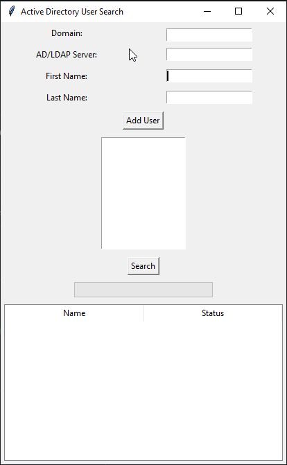

# Active Directory User Search (Python)

## Short Description

This is a simple Python GUI application, built with Tkinter, for checking if users exist in Active Directory. The tool allows you to build a list of users and then search for all of them in a single batch operation, displaying the results in a clear, color-coded table.



---

## Features

* **Simple GUI:** A user-friendly graphical interface built with Python's standard `tkinter` library.
* **Auto-Detection:** Automatically detects the user's current domain and a logon server to use for the LDAP connection.
* **Batch Searching:** Add multiple users to a list to perform a batch search instead of checking one by one.
* **Clear Results:** Displays the search status (Found, Not Found, Error) in a simple table.
* **Color-Coded Status:** The results are colored green (Found), red (Not Found), or yellow (Error) for immediate visual feedback.
* **Progress Bar:** Includes a progress bar that tracks the status of the batch search.

---

## Requirements

1.  **Python:** Python 3.x is required.
2.  **ldap3 Library:** The script depends on the `ldap3` library for its connection to Active Directory.
3.  **Environment:** Must be run on a **domain-joined Windows computer**. The script relies on Windows environment variables to automatically detect the domain and server.

---

## How to Run

1.  **Install Dependencies:** First, you must install the required Python library. Open a command prompt or PowerShell and run:
    ```bash
    pip install ldap3
    ```
2.  **Run the Script:** Navigate to the script's directory and run it using Python:
    ```bash
    python Check_AD-User.py
    ```

---

## Usage Instructions

1.  Launch the script. It will automatically populate the **Domain** and **AD/LDAP Server** fields.
2.  Enter the **First Name** and **Last Name** of a user into the corresponding fields.
3.  Click the **Add User** button. The user's name will be added to the listbox below.
4.  Repeat the process for all users you need to check.
5.  When your list is ready, click the **Search** button.
6.  The search will begin, and the progress bar will update as it checks each user.
7.  The results will appear in the table at the bottom, showing the status for each name on your list.

---

## License

This project is licensed under the **GNU General Public License v3.0**. See the `LICENSE.md` file for details.
